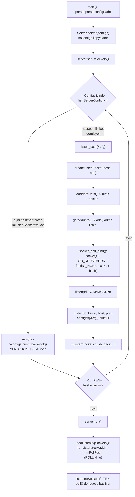
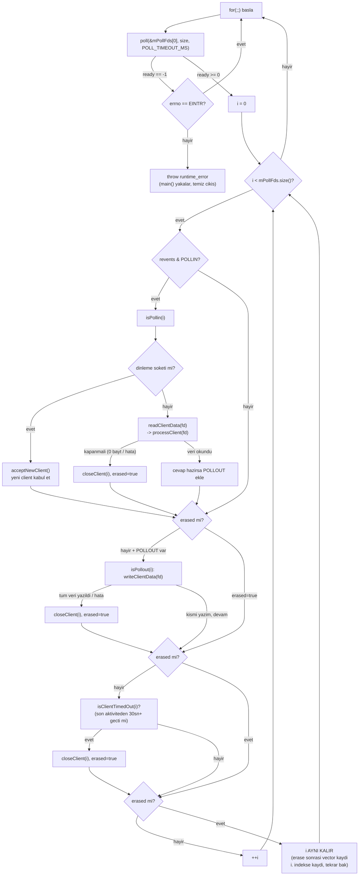
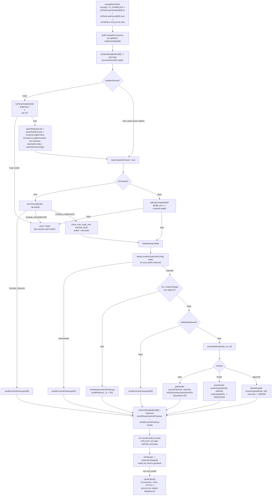
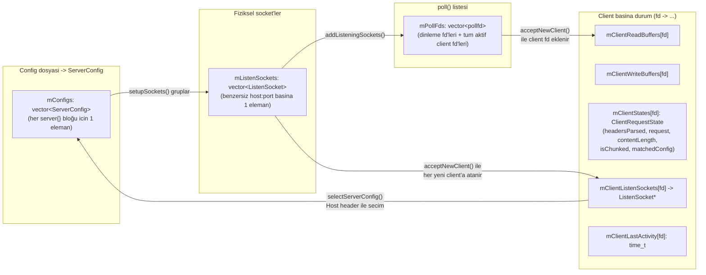

# Server.cpp — Akış Şeması

Bu doküman, `Server.hpp`/`Server.cpp` kapsamındaki (config parse ve CGI hariç, o kısımlar
arkadaşların tarafından yapılıyor) tüm akışı dört bölümde özetler:

1. Başlangıç (socket kurulumu)
2. Ana `poll()` döngüsü
3. Tek bir isteğin baştan sona işlenişi (request lifecycle)
4. Veri yapıları arası ilişki (mConfigs → mListenSockets → mPollFds → client map'leri)

---

## 1) Başlangıç — `main()` → `setupSockets()` → `run()`

**Önemli:** Aynı `host:port`'u paylaşan birden fazla `server{}` bloğu (virtual host) için
sadece **bir** gerçek socket açılır — `mListenSockets[j].configs` listesine ek `ServerConfig*`
eklenir. Bu, `bind()`'in aynı adrese ikinci kez çağrılıp "Address already in use" hatası
almasını da baştan engeller.

---

## 2) Ana Döngü — `listeningSockets()` (TEK `poll()` çağrısı)

**Önemli:** `closeClient(i)` çağrıldığında `mPollFds.erase(mPollFds.begin()+i)` yapılır —
bu, `i+1`'deki elemanı `i`'ye kaydırır. Bu yüzden erase olduğunda `i` **artırılmaz**, aynı
indeks bir sonraki turda yeni elemanı gösterir — aksi halde bir eleman atlanırdı.

---

## 3) Tek Bir İsteğin Yaşam Döngüsü (client bağlandıktan cevap gönderilene kadar)

---

## 4) Veri Yapıları Arası İlişki

---

## Özet — Fonksiyon Katmanları

| Katman | Fonksiyonlar |
|---|---|
| Socket kurulumu | `addrInfoData`, `socket_and_bind`, `createListenSocket`, `listen_data`, `setupSockets`, `addListeningSockets` |
| Ana döngü | `run`, `listeningSockets`, `isPollin`, `isPollout`, `isClientTimedOut`, `closeClient` |
| Client I/O | `acceptNewClient`, `readClientData`, `writeClientData` |
| Request parse | `tryParseHeaders`, `parseRequestLine`, `parseHeaderLines`, `contentLengthCheck`, `isBodyComplete`, `tryUnchunk`, `processClient` |
| Routing | `selectServerConfig`, `selectLocation`, `isPathPrefixMatch`, `isMethodAllowed` |
| Path güvenliği | `hasDotDotSegment`, `joinPath`, `resolveFilePath`, `resolveUploadPath` |
| Method handler'lar | `finalizeRequest`, `controlMethod`, `getHandle`, `postHandle`, `deleteHandle` |
| Dosya I/O | `serveStaticFile`, `writeUploadFile`, `buildAutoindex`, `readWholeFile` |
| Response üretimi | `buildResponse`, `buildRedirect`, `buildErrorResponse`, `getContentType`, `statusTextFor`, `sendResponseAndCleanup`, `sendErrorAndCleanup` |
