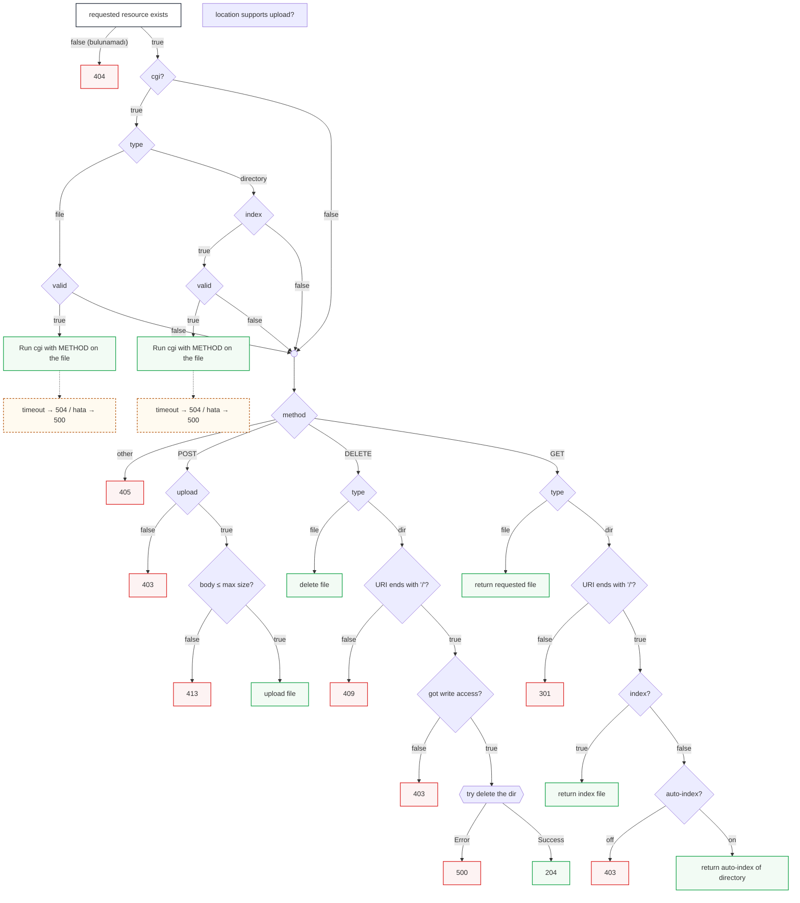

HTTP Request
      |
      v
1. Server seçimi
      |
      v
2. Location seçimi
      |
      v
3. Request türünü kontrol et (GET, POST, DELETE...)
      |
      v
4. Path çözümleme (gerçek dosya yolu)
      |
      v
5. Gerekli işlemi yap
      |
      +--> Dosya gönder (GET)
      |
      +--> Veri al/kaydet (POST)
      |
      +--> Dosya sil (DELETE)
      |
      +--> CGI çalıştır
      |
      v
6. HTTP Response oluştur
      |
      v
7. Client'a gönder

Webserv

main.cpp
 |
 |
ServerManager
 |
 |
+----------------+
| ConfigParser   |
+----------------+

+----------------+
| SocketManager  |
+----------------+

+----------------+
| PollManager    |
+----------------+

+----------------+
| Client         |
+----------------+

+----------------+
| HttpRequest    |
+----------------+

+----------------+
| Router         |
|                |
| matchServer()  |
| matchLocation()|
+----------------+

+----------------+
| Handler        |
|                |
| GET            |
| POST           |
| DELETE         |
| CGI            |
+----------------+

+----------------+
| Response       |
+----------------+

# Webserver — İstek İşleme Akışı

CGI ayrımı, method dispatch (GET / POST / DELETE), 404 / 405 / 413 kontrolleri ve CGI hata/timeout yolları dahil.

## Ek kontroller (bu akışta ele alınan)

| Kod | Ne zaman |
|---|---|
| **404** | İstenen kaynak hiç bulunamazsa |
| **405** | Location, gelen method'a (GET/POST/DELETE dışı) izin vermiyorsa |
| **413** | POST body'si, `client_max_body_size` limitini aşarsa |
| **500 / 504** | CGI script hata verirse / zaman aşımına uğrarsa |
| **409** | DELETE edilecek dizin URI'si `/` ile bitmiyorsa |
| **403** | Upload/delete/autoindex için yazma veya erişim izni yoksa |
| **301** | Dizin isteği `/` ile bitmiyorsa (redirect) |

> Not: GitHub, GitLab, Obsidian, VS Code gibi Mermaid destekleyen ortamlarda bu blok otomatik olarak görsel bir akış şeması şeklinde render edilir.